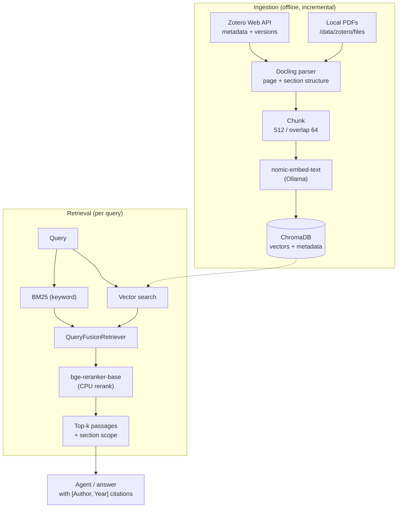
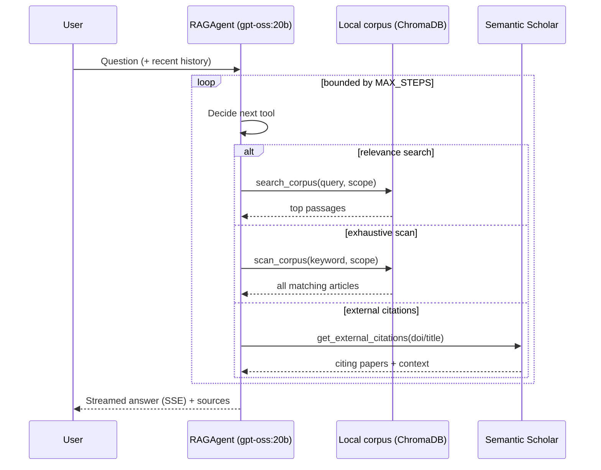
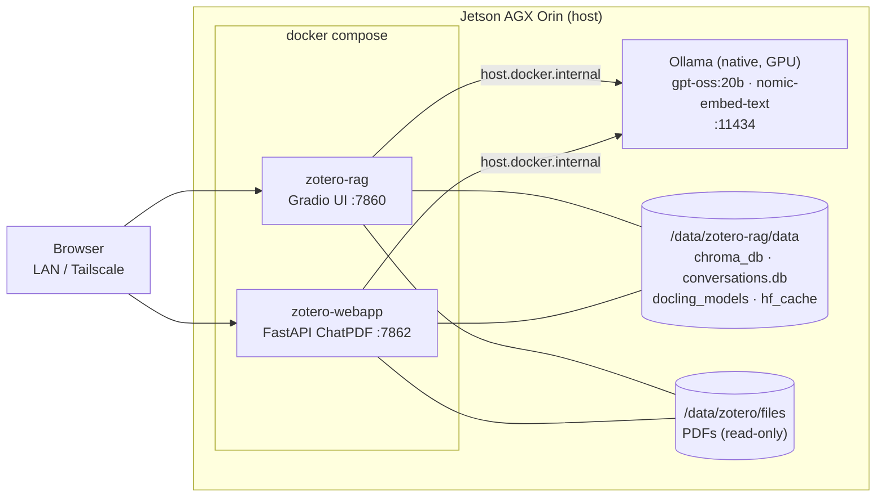

# Zotero RAG — Chat with your Zotero library

A fully local RAG (retrieval-augmented generation) pipeline that lets you ask
natural-language questions about a Zotero library of scientific papers, and get
answers grounded in the actual PDFs, with `[Author, Year]` citations and in-PDF
highlighting of the cited passages.

Runs entirely on a **Jetson AGX Orin** — inference is served by a **native Ollama**
instance; no cloud API key is needed for the LLM or the embeddings. Optionally, it
can enrich answers with worldwide citation data from **Semantic Scholar**.

## Highlights

- **Agentic retrieval.** An LLM agent (`gpt-oss:20b`, native tool-calling) decides on
  its own which tools to call and how many times, rather than running a fixed
  retrieve-then-answer chain.
- **Hybrid search + reranking.** BM25 (keyword) and vector search are fused, then
  reranked by a local cross-encoder (`BAAI/bge-reranker-base`).
- **Section-aware.** Retrieval can be scoped to `content`, `references`, or `all` —
  so "what does the literature say about X" ignores bibliographies, while "who cites
  paper Y in my library" searches exactly them.
- **Two UIs.** A simple Gradio app and a ChatPDF-style web app (chat + conversation
  history + inline PDF viewer).
- **Incremental & offline.** Only modified items are re-parsed; the index is
  persistent; all assets (PDF.js, models) are vendored — no CDN at runtime.

## Architecture

### Ingestion & retrieval pipeline



### Agent tool-calling loop

The agent formulates its own search queries from the conversation context (so a
follow-up like *"and for MPC?"* searches `model predictive control`, not the raw
question), and picks the right tool for the job:



| Tool | Purpose |
| --- | --- |
| `search_corpus` | Relevance search (a few best passages) in the local Zotero library — for questions about *content*. |
| `scan_corpus` | Exhaustive keyword scan across *all* articles — for "which/how many articles mention X". |
| `get_external_citations` | Worldwide citing papers for a given article (Semantic Scholar), with the citation sentence. |

### Deployment



- **Native Ollama** (outside Docker) serves the models on
  `http://host.docker.internal:11434` (listening on `0.0.0.0`, models stored on
  `/data/ollama/models`).
- **Containers read PDFs directly** from `/data/zotero/files` (mounted read-only) —
  no re-download when the file is already on the Jetson.

## Prerequisites (already set up on this Jetson)

- Native Ollama with the models: `gpt-oss:20b`, `nomic-embed-text`
- Docker image `zotero-rag:latest` (torch **CPU-only**, ~2.75 GB)
- Docling models pre-downloaded in `data/docling_models/` (layout + tableformer)
- Reranker `BAAI/bge-reranker-base` cached in `data/hf_cache/` (~1.1 GB, on first run)

## Configuration — `config.yaml`

Key settings (already filled in):

```yaml
zotero:
  mode: "web"                       # metadata via api.zotero.org
  web_api_key: "<key>"
  library_id: "12014782"
  library_type: "user"
  local_files_dir: "/zotero_files"  # local PDFs mounted into the container
ollama:
  base_url: "http://host.docker.internal:11434"
  llm_model: "gpt-oss:20b"          # native tool-calling, used by the agent
  embed_model: "nomic-embed-text"
  timeout: 300
rag:
  chunk_size: 512
  chunk_overlap: 64
  similarity_top_k: 5
agent:
  max_steps: 6                      # bounds the agent's tool-calling loop
semantic_scholar:
  api_key: ""                       # optional; anonymous pool otherwise (may hit 429)
```

> **Changing the LLM** is a one-line edit (`llm_model`). The agent requires a model
> with **native tool-calling**. Avoid very large models: `llama3.1:70b` takes ~13 min
> per answer on this Jetson's integrated GPU.

## Running the service

Two services come up together via `docker compose`:

```bash
cd /data/zotero-rag
docker compose up -d      # Gradio on :7860, ChatPDF web app on :7862
docker compose logs -f    # follow logs
docker compose down       # stop
```

Access (either UI):
- **Gradio** — `http://<jetson>:7860`
- **ChatPDF web app** — `http://<jetson>:7862`
- LAN: `192.168.50.12` · Tailscale: `100.100.84.81`

## Building / updating the index

Via the UI (the "Synchronize Zotero" button), or from the CLI:

```bash
docker compose exec zotero-rag python main.py index                 # full index (~237 PDFs)
docker compose exec zotero-rag python main.py update                # incremental update
docker compose exec zotero-rag python main.py stats                 # statistics
docker compose exec zotero-rag python main.py query "your question" # one-off query
```

> Docling parsing runs on **CPU** (~1–2 min/PDF). A full index of ~237 articles
> therefore takes a while; it is persistent (`data/chroma_db/`) and incremental
> afterwards (only modified items are re-parsed).

**Sync is decoupled from the browser.** Starting a sync from the web app launches a
background job on the server: closing the tab (or switching device) does **not** stop
it, and reopening the page resumes the progress display. A second sync cannot start
while one is already running.

## CLI commands (`main.py`)

| Command | Description |
| --- | --- |
| `index` | Build the complete index from scratch. |
| `update` | Incremental index update (modified items only). |
| `query "<question>"` | One-off query from the command line, with sources. |
| `stats` | Index statistics (documents, chunks, last update, Zotero version). |
| `serve` | Launch the Gradio UI (port 7860). |
| `webserve [--port]` | Launch the ChatPDF-style FastAPI web app (port 7862). |

## Tests

```bash
docker run --rm -v /data/zotero-rag:/app -w /app zotero-rag:latest \
  sh -c "pip install -q pytest && python -m pytest tests/ -q"
# 100 passed
```

## Rebuilding the image

```bash
cd /data/zotero-rag && docker build -t zotero-rag:latest .
```

The Dockerfile uses **uv** (fast resolver) and pins `torch==2.8.0` /
`torchvision==0.23.0` as **CPU-only**: on aarch64 these wheels pull in no `nvidia-*`
dependency (gated `platform_machine=="x86_64"`). Do **not** move to torch ≥ 2.9
(aarch64 CUDA wheels are ~10 GB and useless here — Docling runs on CPU). It also
vendors PDF.js, marked, and DOMPurify at build time so the web UI needs no CDN.

## Project structure

```
zotero-rag/
├── config.yaml   docker-compose.yml   Dockerfile   requirements.txt
├── main.py                     CLI (click): index / update / query / stats / serve / webserve
├── app.py                      Gradio UI
├── zotero_rag/
│   ├── zotero_client.py        Zotero API + local PDF (zip) extraction
│   ├── pdf_parser.py           Docling → structured documents (page, section)
│   ├── indexer.py              ChromaDB + LlamaIndex + incremental state
│   ├── retriever.py            hybrid BM25 + vector fusion, reranker, section scopes
│   ├── agent.py                ReAct tool-calling agent (search/scan/external citations)
│   ├── citations.py            Semantic Scholar Graph API client
│   ├── highlighter.py          PyMuPDF passage highlighting in the PDF
│   └── utils.py
├── webapp/                     ChatPDF-style FastAPI app
│   ├── server.py               routes: docs, PDF, conversations, /api/query (SSE), sync
│   ├── store.py                SQLite conversation history
│   ├── sync_job.py             background Zotero sync job (decoupled from HTTP)
│   └── static/                 index.html, app.js, PDF viewer, vendored JS
├── data/                       chroma_db · conversations.db · docling_models · hf_cache · pdfs
└── tests/                      100 tests
```

## Notes / gotchas

- **torch CPU-only** — must be pinned ≤ 2.8.x (see "Rebuilding").
- **Ollama** — must listen on `0.0.0.0` (systemd override) and store its models on
  `/data` (the 54 GB eMMC `/` fills up quickly). Already configured.
- **Docling models** — pre-downloaded into `data/docling_models` because
  `DOCLING_ARTIFACTS_PATH` expects an already-populated folder.
- **Items without a PDF** are not indexed by design: Zotero entries with no attached
  PDF are structurally excluded, so the indexed count is lower than the total number
  of entries shown in the Zotero desktop app.
```